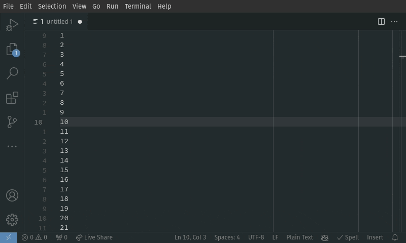

# Relative Motion for VSCode

Vaguely vim-like cursor-relative line jumping through the Command Pallette.

This extension is intended for use with the `"editor.lineNumbers": "relative"` setting by adding commands for navigating up and down a user-provided number of lines through a Command Pallette Input Box.

Inspiration was taken from the built-in 'Go to line/column' (`workbench.action.gotoLine`) command for the interface and feedback, as well as [EnkelDigital] and [JJ Lee]'s [relativity] extension

[EnkelDigital]: https://github.com/Enkel-Digital/
[JJ Lee]: https://github.com/Jaimeloeuf
[relativity]: https://marketplace.visualstudio.com/items?itemName=EnkelDigital.relativity

TODO: Add scripts for bundling the extension

TODO: Publish the extension

## Features

Provides the following commands;

|                               |         |
| :---------------------------- | ------- |
| `vscode-relative-motion.up`   | `alt+k` |
| `vscode-relative-motion.down` | `alt+j` |

## Requirements

Though not a strict requirement, this extension makes a lot more sense when using relative line numbers,

// TODO: Capture a image of the VSCode setting & a file showing relative line numbers.

// TODO: You know... I can probably override the gutter's style, same way the built-in 'Go to line/column' command does. That sounds fun, and also like something that should be opt-out-able w/ an extension setting.

## Extension Settings

<!-- This extension contributes the following settings:

* `myExtension.enable`: Enable/disable this extension.
* `myExtension.thing`: Set to `blah` to do something. -->

## Known Issues

None yet!

If you find something wrong with this extension or have a feature request, please open an issue in this repository with a detailed description and, if applicable, minimal reproduction case.

## Release Notes

### 0.1.0

Proof-of-Concept commands thunked into an official home!
