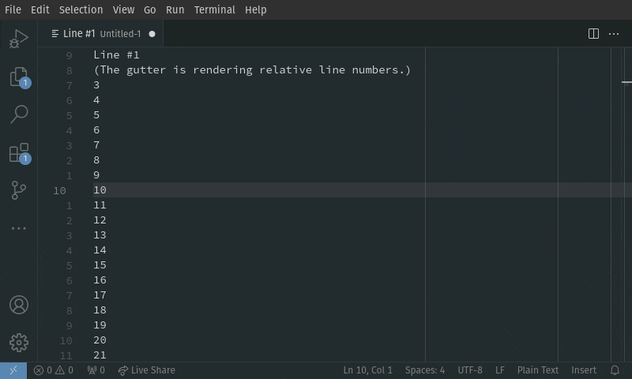

# Relative Motion for VSCode

Vaguely vim-like cursor-relative line jumping through the Command Pallette.

Inspiration was taken from the built-in 'Go to line/column' (`workbench.action.gotoLine`) command for the interface and feedback, as well as [EnkelDigital] and [JJ Lee]'s [relativity] extension

[EnkelDigital]: https://github.com/Enkel-Digital/
[JJ Lee]: https://github.com/Jaimeloeuf
[relativity]: https://marketplace.visualstudio.com/items?itemName=EnkelDigital.relativity

TODO: Add scripts for bundling the extension

TODO: Publish the extension

## Features

Provides the following commands;

|                                |         |                               |
| :----------------------------- | ------- | :---------------------------- |
| Relative Motion: Navigate Up   | `alt+k` | `vscode-relative-motion.up`   |
| Relative Motion: Navigate Down | `alt+j` | `vscode-relative-motion.down` |

## Extension Settings

* `relativeMotion.previewRelativeLineNumbers`: Render relative line numbers when previewing Relative Motion's navigation.

## Known Issues

None yet!

If you find something wrong with this extension or have a feature request, please open an issue in this repository with a detailed description and, if applicable, minimal reproduction case.

## Release Notes

### 0.1.0

Proof-of-Concept commands thunked into an official home!
